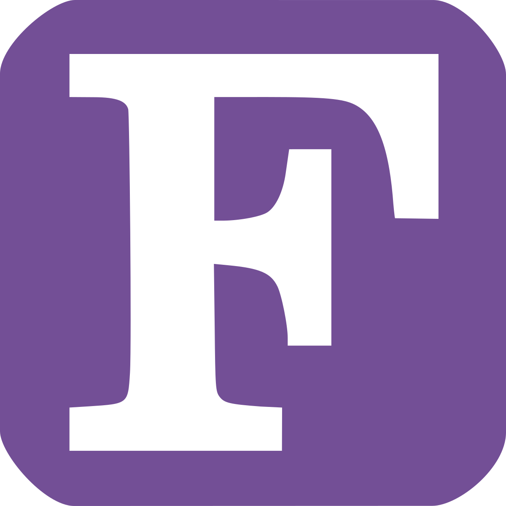

# FathersDay

My Dad taught me programming from a relatively young age until he unexpectedly died in 2016.

As an annual homage to my dad, I write a silly program making use of different languages/paradigms/language features. Here's a list below of what I've done so far:

- 2025:  Java (reflective programming)
- 2024:  Rust (ownership)
- 2023:  C# (asynchronous programming)
- 2022:  Go
- 2021:  Fortran
- 2020:  Python
- 2019:  Delphi
- 2018:  C++
- 2017:  MatLab
- 2016:  PHP (OOP)
- 2015:  PHP (procedural)
